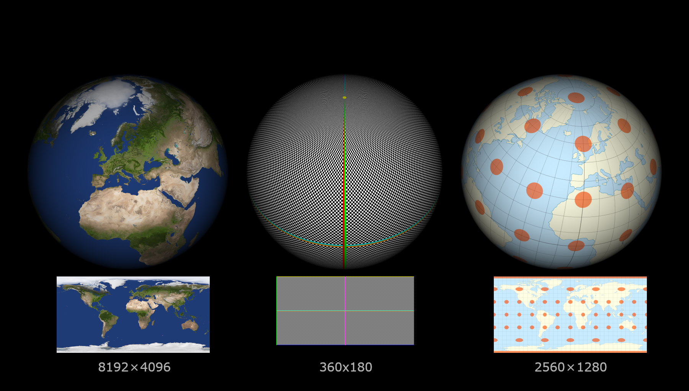
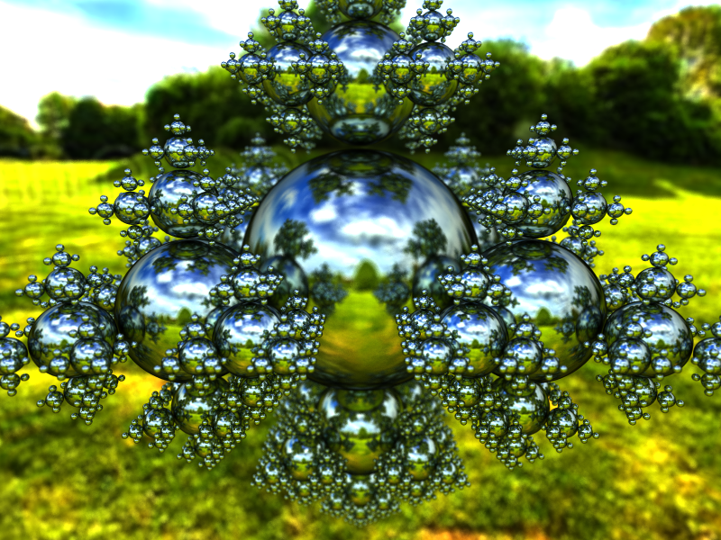
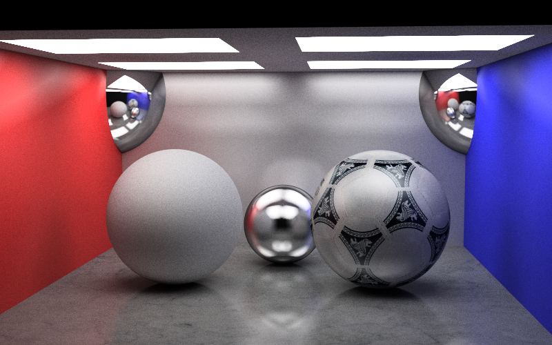

= Gallery
:toc:

Some images to illustrate renderer functionality and some _show off_ gems.

== Brag 'n' boost

Nope, nothing to brag about yet.... :/

== Functionality

=== Pathtracing

==== Cornell box

.The classic Cornell box. Color bleeding. Lightning fixed for raw image in post render editor.
image::cornellbox.png[Cornell box]
.Cornell box image details
----
Image size:             800x500
Amount samples/pixel:   16384
Max recursion depth:    8
Amount facets:          12
Amount spheres:         2
Frame render time: 7h52m49.628069625s
----

==== Material - Reflection

Reflection is not just "mirror" parameter on materials, but it is split in two parameters to simulate metal properties. The two parameters are "glossiness" and "roughness".

Glossiness is the parameter that is the common "mirror" parameter that most tracers implement that is the normal reflection control.

Roughness is how rough the mirror surface is, much like the real world material "brushed aluminum".

.Light green sphere with reflective parameters glossiness (increasing from left=0.0 to right=1.0) and roughness (increasing from bottom=0.0 to top=1.0)
image::reflection.png[Reflective parameters glossiness and roughness]

.Reflection image details
----
Image size:             1350x900
Amount samples/pixel:   3072
Max recursion:          6
Amount spheres:         49
----

==== Depth of Field (DOP)

Depth of Field with a configurable aperture at the camera.
The depth of field depends on both aperture size (radius) and focal length.

.Depth of field using aperture 12.0 (in units, not actual 12f as in camera lenses) and "view plane distance" (the distance to perfect focus point) 2000.
[cols=">a,<a", frame=none, grid=none]
|===
|image::dop_01.png[alt="Depth of field (none)"]
|image::dop_02.png[alt="Depth of field"]
|===

.DOP Image details
----
Image size:             800x400
Amount samples/pixel:   2048
Max recursion:          4
Amount spheres:         6
Frame render time: 3h46m48.561010458s
----

.Depth of field using aperture 12.0 (in units, not actual 12f as in camera lenses) and "view plane distance" (the distance to perfect focus point) 2000.
[cols=">a,<a", frame=none, grid=none]
|===
|image::dop_01.png[alt="Depth of field (none)"]
|image::dop_02.png[alt="Depth of field"]
|===

.DOP Image details
----
Image size:             800x400
Amount samples/pixel:   2048
Max recursion:          4
Amount spheres:         6
Frame render time: 3h46m48.561010458s
----

==== Aperture shape

A funny and fancy, but not so useful, feature is the ability to change the aperture shape.
This will have effect in "night shots", much like as in movies with the soft blur out of focus shapes of lights at night.

A round aperture gives round blur shapes and other shapes of the aperture will give... other shapes.

Note that out of focus in the foreground gives the shape upside down and flipped left with right, while out of focus in the background will give shapes "correct" as in the aperture.

.Different aperture shapes for a matrix of luminous balls
image::aperture_shapes.png[Different aperture shapes]

A short animation clip with luminous balls and a star shaped aperture can be found at https://vimeo.com/801995169[Vimeo] (it should be played in a loop though).

===== Depth of field (and aperture shape)

To make a common pinhole camera to be more like a real world camera with depth of field (i.e. able to have parts of the image "out of focus" either in front or behind a focus plane) you will need a "focus distance" and an "aperture size" (or lens radius if you will).

This will not make a accurate simulation, with respect to physics and mathematics, of a very complex camera lens with multiple movable glass lenses in groups and all the real world artefacts that comes with it. But it will still make out a very decent, simplified, model of how a camera with aperture works.

1. First shoot a "perfect" ray from the camera at center of the aperture through your view plane pixel position (pixelX, pixelY). The point where this ray intersect the focus plane is the focus point for the pixel (pixelX, pixelY).

2. All other sample rays shot from the camera in your path tracer should start at random point on the aperture disc and pass through the focus point for the pixel (pixelX, pixelY).

The simplest aperture shape is usually "round circle" as it is simple to implement and very camera like. However, if you do not sample start points for rays randomly on the aperture disc but rather randomly within another shape than a round circle, your out of focus bokeh will be of the shape you sampled. For example heart, star, or letter 'F' shaped as shown in example images.

.How different aperture shapes, and depth of field in general, works
image::dop.png[How different apertures, and depth of field in general, works]

==== Image projection - Spherical

Spherical projection is made from equirectangular images and allow for an image to be projected onto an object from all angles.

A nifty feature is that you can place your actual scene (objects), camera and lighting within a sphere with spherical projection and you will get an environmental projection dome (sphere) as background.

.Spherical projection

.Spherical projection as environmental projection

.Image details
----
Amount samples/pixel:   1024
Max recursion:          8
Amount spheres:         4688
----

=== Metallic like settings "glossy" and "roughness"

.A Cornell box with "metallic like" settings. Lightning fixed for raw image in post render editor.

Using "glossy" and "roughness" parameters rather than the usual "mirror/diffuse".
The algorithms for metallicness that I tried out, are my own and are most likely not true to the path tracing concept of conservation of energy. (I believe that the algorithms introduce a bit of energy to the system.) +
But hey, nice and pretty decent effect though...

A short animation clip can be found at https://vimeo.com/758989253[Vimeo] (it should be played in a loop though).

.Cornell box details
----
Image size:        800x500
Amount samples:    1800
Max recursion:     6
Amount facets:     18
Amount spheres:    5
Total execution time: 14h6m26.331560583s
----
